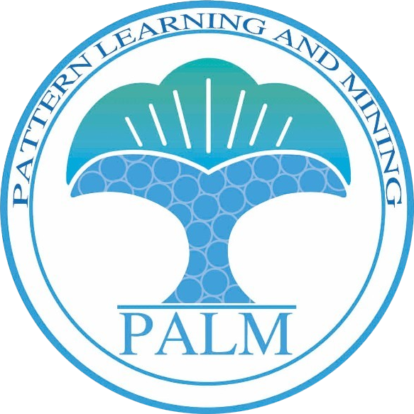

<h1 align="center">东南大学 PALM 实验室</h1>

<p align="center">
  
</p>

<p align="center">
  
  
  
  
  
</p>

## PALM Lab 官网

PALM（PAttern Learning and Mining）实验室隶属东南大学计算机科学与工程学院，本仓库的 **`app/`** 目录是实验室官方公开展示站源码，部署于 [palmlab.cn](https://palmlab.cn)。

### 快速开始

```bash
cd app
pnpm install
pnpm dev      # http://localhost:3000
pnpm build
pnpm start
```

Vercel 部署时将 **Root Directory** 设为 `app` 即可。

### 目录说明

| 目录 | 说明 |
|------|------|
| `app/` | **生产** — Next.js 公开展示站 |
| `web/` | 归档 — 旧 AMS 前端（Vue），不再部署 |
| `server/` | 归档 — 旧 AMS 后端（Django），不再部署 |
| `archive/` | 本地归档（已 gitignore） |

---

<h2 align="center">研究生招生管理系统（AMS，已归档）</h2>

<p align="center">
  
  
</p>

<p align="center">
  
  
  
  
  
</p>

## 📖 项目简介

> **注意**：AMS 前后端已不再用于生产环境，代码保留在 `web/` 与 `server/` 供参考。当前生产部署的是 `app/` 目录下的 Next.js 官网。

东南大学 PALM 实验室研究生招生管理系统 (PALM AMS - Pattern Learning and Mining Lab Admissions Management System) 是一个现代化的教育机构招生管理平台。系统采用前后端分离架构设计，为 PALM 实验室提供完整的招生流程管理、学生信息管理、面试评分、数据统计分析等功能，致力于提升招生工作效率，优化管理流程。

### 系统主页
<p align="center">
  
</p>

### 登录界面
<p align="center">
  
</p>

### 筛选功能
<p align="center">
  
  
</p>

### 面试评分
<p align="center">
  
</p>

### 数据统计
<p align="center">
  
</p>

### 系统设置
<p align="center">
  
  
  
</p>

### ✨ 核心特性

- 🎯 **多类型申请通道**：支持推免、考研、博士、直博四种申请类型
- 📝 **智能表单系统**：动态字段配置，支持论文、奖项等复杂信息录入
- 👥 **学生信息管理**：完整的申请者档案管理和状态跟踪
- 🎯 **面试评分系统**：标准化面试流程和评分机制
- 📊 **数据分析仪表盘**：实时统计图表，支持多维度数据分析
- 🔍 **高级筛选功能**：多条件组合筛选，快速定位目标申请者
- ⚙️ **灵活配置管理**：院校、专业、人员、奖项等基础数据可配置
- 📱 **响应式设计**：完美适配桌面端和移动端
- 🔐 **权限管理系统**：基于角色的访问控制
- 📄 **文件管理**：支持简历、证明材料等文件上传和管理

## 🛠️ 技术栈

### 前端技术
- **框架**：Vue 3.5.10 + TypeScript
- **构建工具**：Vite 5.4.14
- **UI 组件库**：Element Plus 2.9.3
- **样式框架**：Tailwind CSS 3.4.17 + Sass
- **状态管理**：Pinia 2.3.0
- **路由管理**：Vue Router 4.4.5
- **HTTP 客户端**：Axios 1.7.7
- **图表库**：ECharts 5.5.1
- **工具库**：UUID、JSZip、XLSX、SortableJS

### 后端技术
- **框架**：Django 4.2.0 + Django REST Framework
- **数据库**：MySQL 8.0+
- **数据库驱动**：PyMySQL 1.1.1
- **跨域处理**：django-cors-headers
- **身份验证**：PyJWT
- **数据处理**：Pandas、openpyxl、xlwt
- **图像处理**：Pillow

### 开发工具
- **代码规范**：ESLint + Commitlint + Husky
- **部署**：Nginx + uWSGI
- **版本控制**：Git

## 🚀 快速开始

### 环境要求

- **Node.js**: >= 16.0.0
- **Python**: >= 3.8
- **MySQL**: >= 8.0
- **pnpm**: >= 7.0 (推荐) 或 npm

### 安装步骤

#### 1. 克隆项目

```bash
git clone https://github.com/JacksonHe04/palm.git
cd palm
```

#### 2. 前端环境配置

```bash
cd web
pnpm install
# 或使用 npm install
```

#### 3. 后端环境配置

```bash
cd server
pip install -r requirements.txt
```

#### 4. 数据库配置

1. 创建 MySQL 数据库：
```sql
CREATE DATABASE palm_apply CHARACTER SET utf8mb4 COLLATE utf8mb4_unicode_ci;
```

2. 修改 `./server/ApplicationSystem/settings.py` 中的数据库配置：
```python
DATABASES = {
    'default': {
        'ENGINE': 'django.db.backends.mysql',
        'NAME': 'palm_apply',
        'HOST': '127.0.0.1',
        'PORT': 3306,
        'USER': 'your_username',
        'PASSWORD': 'your_password',
    }
}
```

3. 执行数据库迁移：
```bash
cd server
python manage.py makemigrations
python manage.py migrate
```

#### 5. 启动服务

**启动后端服务：**
```bash
cd server
python manage.py runserver 8000
```

**启动前端服务：**
```bash
cd web
pnpm dev
# 或 npm run dev
```

访问 `http://localhost:5173` 即可使用系统。

### 生产环境部署

#### 前端构建
```bash
cd web
pnpm build
```

#### 后端部署
系统支持 uWSGI + Nginx 部署方式，详细配置请参考 `./nginx/` 目录下的配置文件。

## 📁 项目结构

```
palm/
├── web/                 # 前端项目 (Vue 3 + TypeScript)
│   ├── src/
│   │   ├── apis/              # API 接口定义
│   │   ├── components/        # 公共组件
│   │   ├── router/            # 路由配置
│   │   ├── stores/            # Pinia 状态管理
│   │   ├── styles/            # 样式文件
│   │   ├── types/             # TypeScript 类型定义
│   │   ├── utils/             # 工具函数
│   │   └── views/             # 页面组件
│   │       ├── front-desk/    # 前台页面
│   │       ├── management/    # 后台管理页面
│   │       └── login/         # 登录页面
│   ├── public/                # 静态资源
│   ├── package.json
│   └── vite.config.js         # Vite 配置
├── server/               # 后端项目 (Django)
│   ├── Api/                   # API 应用模块
│   │   ├── apply/             # 申请管理
│   │   ├── auth/              # 身份验证
│   │   ├── students/          # 学生管理
│   │   ├── interview/         # 面试管理
│   │   ├── setting/           # 系统设置
│   │   ├── field/             # 字段配置
│   │   ├── files/             # 文件管理
│   │   └── ...
│   ├── ApplicationSystem/     # Django 项目配置
│   ├── database/              # 数据库模型
│   ├── static/                # 静态文件
│   ├── templates/             # 模板文件
│   ├── manage.py
│   └── requirements.txt       # Python 依赖
├── nginx/                     # Nginx 配置文件
├── docs/                      # 项目文档
│   ├── help/                  # 帮助文档
│   ├── images/                # 截图
│   └── release/               # 版本发布说明
├── .github/                   # GitHub 配置
├── package.json               # 项目根配置
├── commitlint.config.js       # 提交规范配置
└── README.md                  # 项目说明
```

## 🔧 功能模块详解

### 前台功能

#### 申请系统
- **推免申请通道** (`/apply/recommend-master`)：推荐免试研究生申请
- **考研申请通道** (`/apply/exam-master`)：统考硕士研究生申请
- **博士申请通道** (`/apply/phd`)：博士研究生申请
- **直博申请通道** (`/apply/direct-phd`)：本科直接攻读博士申请

#### 信息展示
- **实验室介绍** (`/introduction`)：PALM 实验室详细介绍
- **成员展示** (`/members`)：实验室成员信息
- **学术成果** (`/academics`)：研究成果和论文发表
- **新闻动态** (`/news`)：实验室最新动态

### 后台管理功能

#### 数据管理
- **学生表格** (`/manage/students`)：申请者信息管理和查看
- **数据库管理** (`/manage/database`)：数据库操作和维护
- **录取结果** (`/manage/result`)：录取状态管理
- **录取失败** (`/manage/failed`)：未录取申请者管理

#### 评估系统
- **面试打分** (`/manage/interview`)：面试评分和记录
- **百分比统计** (`/manage/percent`)：各项指标百分比分析
- **数据分析** (`/manage/analysis`)：多维度数据统计和图表展示

#### 系统配置
- **规则设置** (`/manage/setting`)：录取规则和条件配置
- **字段配置** (`/manage/field`)：表单字段动态配置
- **账号管理** (`/manage/account`)：用户权限和账号管理

## 📡 API 接口文档

### 申请相关接口

```typescript
// 提交申请
POST /api/apply/
// 获取学生列表
GET /api/students/
```

### 设置相关接口

```typescript
// 院校配置
GET /api/settings/universities/
PUT /api/settings/universities/

// 专业配置
GET /api/settings/majors/
PUT /api/settings/majors/

// 人员配置
GET /api/settings/personnel/
PUT /api/settings/personnel/

// 奖项配置
GET /api/settings/awards/
PUT /api/settings/awards/

// 年份设置
GET /api/settings/year/
PUT /api/settings/year/
```

### 数据模型

#### Apply 模型 (申请者信息)

```python
class Apply(models.Model):
    # 基本信息
    id = models.CharField(primary_key=True, max_length=255)
    name = models.CharField(max_length=255)
    applicationType = models.CharField(max_length=255)  # 申请类型
    year = models.IntegerField()  # 申请年份
    
    # 教育背景
    university = models.CharField(max_length=255)  # 本科院校
    major = models.CharField(max_length=255)  # 专业
    rank = models.IntegerField()  # 排名
    percentage = models.CharField(max_length=255)  # 百分比
    
    # 联系方式
    phone = models.CharField(max_length=255)
    email = models.CharField(max_length=255)
    
    # 志愿选择
    firstChoice = models.CharField(max_length=255)
    secondChoice = models.CharField(max_length=255)
    thirdChoice = models.CharField(max_length=255)
    
    # 论文信息 (支持最多3篇)
    paper1_paperName = models.CharField(max_length=255)
    paper1_ccfLevel = models.CharField(max_length=255)
    paper1_isFirst = models.BooleanField()
    
    # 奖项信息 (支持最多3项)
    award1_awardName = models.CharField(max_length=255)
    award1_levelRanking = models.CharField(max_length=255)
    award1_isLeader = models.BooleanField()
    
    # 状态字段
    status = models.CharField(max_length=255)
    isFilterCondition = models.CharField(max_length=255)
```

## 🛠️ 开发指南

### 代码规范

项目使用 ESLint + Commitlint + Husky 确保代码质量：

```bash
# 代码检查
pnpm lint-vue  # Vue 文件检查
pnpm lint-ts   # TypeScript 文件检查

# 提交规范
git commit -m "feat: 添加新功能"
git commit -m "fix: 修复bug"
git commit -m "docs: 更新文档"
```

### 提交类型规范

- `feat`: 新功能
- `fix`: 修复 bug
- `docs`: 文档更新
- `style`: 代码格式调整
- `refactor`: 重构
- `perf`: 性能优化
- `test`: 测试相关
- `chore`: 构建过程或辅助工具变动

### 开发环境配置

1. **前端开发**：
   - 使用 Vite 热重载开发服务器
   - 支持 TypeScript 类型检查
   - 集成 Tailwind CSS 实时编译

2. **后端开发**：
   - Django 开发服务器自动重载
   - 支持 Django REST Framework 调试
   - 集成 CORS 跨域支持

### 部署说明

#### 开发环境
```bash
# 前端
cd web && pnpm dev

# 后端
cd server && python manage.py runserver
```

#### 生产环境
```bash
# 前端构建
cd web && pnpm build

# 后端部署 (使用 uWSGI + Nginx)
uwsgi --ini palm.ini
```

## 🤝 贡献指南

1. Fork 本仓库
2. 创建特性分支 (`git checkout -b feature/AmazingFeature`)
3. 提交更改 (`git commit -m 'feat: Add some AmazingFeature'`)
4. 推送到分支 (`git push origin feature/AmazingFeature`)
5. 打开 Pull Request

### 贡献者

- **JacksonHe04** - *项目创建者和主要维护者*

## 📄 相关文档

- [项目介绍文档](./docs/help/1-Intro.md)
- [加入项目指南](./docs/help/2-加入项目与克隆到本地.md)
- [本地开发指南](./docs/help/3-本地编写代码并推送.md)
- [云服务器部署](./docs/help/4-云服务器.md)
- [版本发布说明](./docs/release/)

## 🔗 相关链接

- [PALM 实验室官网](https://palmlab.cn)
- [GitHub 仓库](https://github.com/JacksonHe04/palm)
- [问题反馈](https://github.com/JacksonHe04/palm/issues)

## 📞 联系方式

如有问题或建议，请通过以下方式联系：

- **邮箱**: JacksonHe04c@gmail.com
- **GitHub**: [@JacksonHe04](https://github.com/JacksonHe04)

## 📄 许可证

本项目采用 MIT 许可证 - 查看 [LICENSE](./LICENSE) 文件了解详情。

---

<p align="center">
  <strong>⭐ 如果这个项目对你有帮助，请给它一个 Star！</strong>
</p>

<p align="center">
  Made with ❤️ by <a href="https://github.com/JacksonHe04">JacksonHe04</a>
</p>
